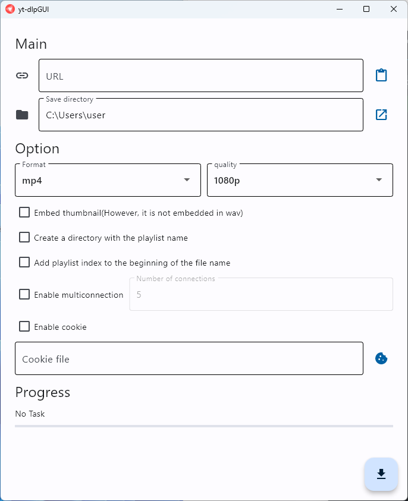

# yt-dlpGUI
Just added a GUI to yt-dlp

## Main Features
- Download videos from sites like YouTube
- Extract audio
- Load cookies from a txt file
- Adjust the number of concurrent connections

## Notes on Usage
Please refrain from using downloaded content for commercial purposes.  
This software is not created for the purpose of copyright infringement through unauthorized reproduction, etc.  
Increasing the number of concurrent connections can improve download speed, but may result in access restrictions.

I, the creator of this software, cannot be held responsible for any damages incurred through its use.

## Reporting Bugs
If you encounter any bugs, please open an issue.  
Please also provide information on your current OS version, Python version, and the presence/name of any security software you are using, as this information can help in resolving issues.

## Screenshot
